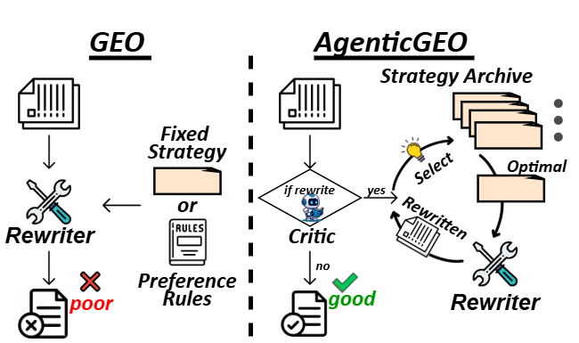
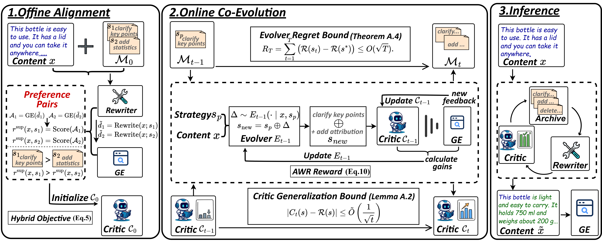

# AgenticGEO: Un Sistema Agente Autoevolutivo para Optimización de Motores Generativos ([Artículo](https://arxiv.org/pdf/2603.20213v1))
> 🤖 **GEO adaptativo al contenido en un clic: reescritura en múltiples turnos con retroalimentación mínima.**

<table width="100%">
<tr>
<td valign="top" width="50%">

- 🧩 **Qué**: Optimizar la *visibilidad y atribución* de documentos en motores de búsqueda generativos de caja negra (Optimización de Motores Generativos, GEO por sus siglas en inglés).
- 🔧 **Cómo**: Modelar el GEO como un **problema condicionado al contenido**, y luego entrenar un archivo de estrategias MAP‑Elites + un crítico coevolutivo para la selección de estrategias de reescritura.
- 🚀 **Por qué es importante**: El GEO a menudo depende de un prompt fijo supuestamente óptimo a nivel global; AgenticGEO aprende una política de selección de estrategias adaptativa al contenido, optimizando con menos llamadas al GE.

</td>
<td valign="top" width="50%">

<p align="center">
  
</p>

</td>
</tr>
</table>

---

## ✨ Highlights

- **GEO condicionado al contenido** bajo motores de caja negra no estacionarios.
- **Memoria de estrategias de calidad‑diversidad (MAP‑Elites)** para selección adaptativa de estrategias.
- **Crítico coevolutivo** como evaluador sustituto y planificador en tiempo de inferencia.
- **Régimen de baja retroalimentación**: se mantiene un alto rendimiento con llamadas limitadas al GE (ver artículo).

---

## 🧭 Overview

<p align="center">
  
</p>

AgenticGEO consta de tres etapas:

1. **Alineación del Crítico Offline**: inicio cálido de un crítico ligero utilizando pares de preferencia offline.
2. **Coevolución Online de Estrategia–Crítico**: coevolucionar un archivo MAP‑Elites y recalibrar continuamente el crítico con retroalimentación limitada del GE.
3. **Reescritura en Múltiples Turnos en Tiempo de Inferencia**: la planificación guiada por el crítico selecciona una secuencia de estrategias adaptativa al contenido.

---

## 📏 Metrics

Utilizamos las métricas de impresión de [GEO‑Bench](https://github.com/GEO-optim/GEO):
- **Recuento de Palabras Atribuidas (word)**
- **Orden de Citas Ponderado por Posición (pos)**
- **General** (combinación de word & pos)

---

## 🚀 Quickstart

### 1) Instalar dependencias

```bash
pip install -r requirements.txt
```

### 2) Preparar el modelo base del Crítico (ruta local)

`src/run_geo.py` carga un modelo base **para la arquitectura/tokenizador** (p. ej. `Qwen/Qwen2.5-1.5B-Instruct`). Puedes descargarlo en `base_model/` usando el script proporcionado:

```bash
python base_model/download_base_model.py
```

### 3) Precargar las fuentes del conjunto de datos en la caché (recomendado)

`src/run_geo.py` lee las fuentes desde `src/global_cache.json`. La precarga evita fuentes faltantes en tiempo de ejecución.

- **GEO-Bench** ([GEO-optim/GEO](https://github.com/GEO-optim/GEO)):

```bash
python src/preload_cache_from_geobench.py
```

- **MSdata**:

```bash
python src/preload_cache_from_msdata.py
```

### 4) Configurar el endpoint del LLM (compatible con OpenAI)

El repositorio lee la configuración compatible con OpenAI desde `config.ini` (o variables de entorno).

- **Usando un servidor local compatible con OpenAI** (p. ej. servidor vLLM / llama.cpp / cualquier servicio compatible):
  - Establecer en `config.ini`:
    - `USE_LOCAL_LLM = True`
    - `LOCAL_LLM_BASE = http://localhost:8000/v1`
    - `LOCAL_LLM_MODEL = <tu nombre de modelo servido>`

- **Usando OpenAI o un proveedor alojado compatible**:
  - Establece `USE_LOCAL_LLM = False` y proporciona `OPENAI_API_KEY` / `OPENAI_API_BASE` en `config.ini`
  - También puedes anularlos mediante variables de entorno (recomendado para CI/servidores)

---

### 5) Ejecutar evaluación

#### Variables de entorno requeridas (mínimas)

```powershell
# Tipo y división del conjunto de datos
$env:DATASET_TYPE  = "geobench"   # geobench | msdata | ecommerce
$env:DATASET_SPLIT = "test"       # train | test | val

# Ruta del modelo base (para estructura/tokenizador del Crítico)
$env:EVOLVED_BASE_MODEL = "E:\AICling\agentic_geo\base_model"
```

#### Crítico y estrategias (carga automática desde `evolved/` por defecto)

No se requieren pesos adicionales por defecto; `src/run_geo.py` cargará automáticamente:

- Estrategias: `evolved/archive/strategies.json`
- LoRA del Crítico: `evolved/critic/lora_adapter/`
- Cabeza de valor del Crítico: `evolved/critic/value_head.bin`

Si deseas anular alguno de ellos, establece estas variables de entorno **opcionales** (las rutas pueden ser absolutas o relativas a la raíz del proyecto):

```powershell
# Opcional: anular archivo de estrategias
# $env:EVOLVED_STRATEGIES = "E:\ruta\hacia\strategies.json"

# Opcional: anular cabeza de valor
# $env:EVOLVED_VALUE_HEAD = "E:\ruta\hacia\value_head.bin"

# Opcional: anular adaptador LoRA
# $env:EVOLVED_LORA_ADAPTER = "E:\ruta\hacia\lora_adapter"

# Opcional: anular pesos del modelo base (p. ej. pytorch_model.bin)
# $env:EVOLVED_PRETRAINED_BACKBONE = "E:\ruta\hacia\pytorch_model.bin"
```

#### Concurrencia y caché (opcional)

```powershell
$env:USE_CONCURRENT = "True"
$env:MAX_WORKERS    = "10"

# Opcional: ubicación del archivo de caché (por defecto: src/global_cache.json)
# $env:GLOBAL_CACHE_FILE = "E:\AICling\agentic_geo\src\global_cache.json"
```

#### Ejecutar

```bash
python src/run_geo.py
```

---

#### Salida

El script imprime la ruta de salida final. Los resultados se guardan en `src/results/` con un nombre de archivo como:

- `geo_results_{model}_{split}.json`

Donde `{model}` proviene de:

- `LOCAL_LLM_MODEL` en `config.ini` (cuando `USE_LOCAL_LLM=True`), o
- variable de entorno `MODEL_NAME` (cuando `USE_LOCAL_LLM=False`)

## 🧪 Reproducibilidad (configuración del artículo)

- Modelo base del Crítico: **Qwen2.5‑1.5B**
- Evolucionador: **Qwen2.5‑7B‑Instruct**
- Modelo de la herramienta de reescritura: **Qwen2.5‑32B‑Instruct**
- GEs de destino: **Qwen2.5‑32B‑Instruct / Llama‑3.3‑70B‑Instruct**
- Ajuste fino: LoRA, 2 épocas
- Inferencia: seleccionar las **25 mejores** estrategias, hasta **3** pasos de reescritura

---

<!-- ## 📝 Citation

```bibtex
@article{agenticgeo2026,
  title   = {AgenticGEO: A Self-Evolving Agentic System for Generative Engine Optimization},
  author  = {Anonymous},
  journal = {arXiv preprint arXiv:XXXX.XXXXX},
  year    = {2026}
}
```

--- -->
## 🪪 Licencia

Este proyecto se distribuye bajo la **Licencia MIT**. Consulta `LICENSE`.

---

## 🙏 Agradecimientos

Agradecemos a los autores de [GEO‑Bench](https://github.com/GEO-optim/GEO) y al ecosistema de LLM de código abierto.
