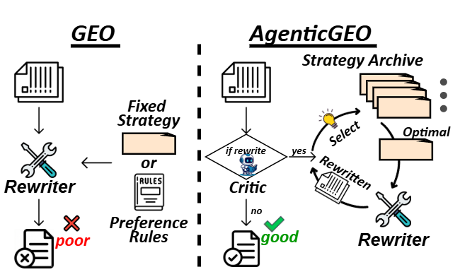
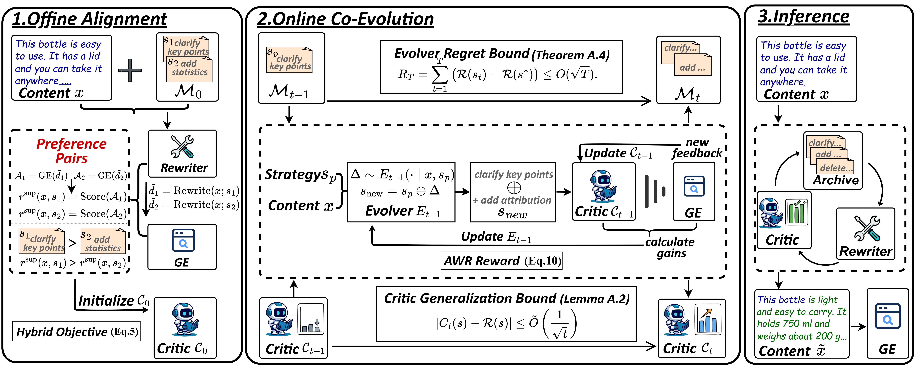

# AgenticGEO: A Self‑Evolving Agentic System for Generative Engine Optimization


<table width="100%">
<tr>
<td valign="top" width="50%">

- 🧩 **What**: Optimize document *visibility & attribution* in black‑box generative search engines (Generative Engine Optimization, GEO).
- 🔧 **How**: Model GEO as **content‑conditioned control**, then use a MAP‑Elites strategy archive + co‑evolving critic for rewriting strategy selection and continual adaptation.
- 🚀 **Why it matters**: GEO often relies on an assumed globally-optimal fixed strategy; AgenticGEO learns a content-adaptive strategy selection polic via an evolving archive + critic, optmizing with fewer GE calls.

</td>
<td valign="top" width="50%">

<p align="center">
  
</p>

</td>
</tr>
</table>

---

## ✨ Highlights

- **Content‑conditioned GEO** under non‑stationary black‑box engines.
- **Quality‑diversity strategy memory (MAP‑Elites)** for adaptive strategy selection.
- **Co‑evolving critic** as a surrogate evaluator & inference‑time planner.
- **Low feedback regime**: strong performance retained with limited GE calls (see paper).

---

## 🧭 Overview

<p align="center">
  
</p>

AgenticGEO consists of three stages:

1. **Offline Critic Alignment**: warm‑start a lightweight critic using offline preference pairs.
2. **Online Strategy–Critic Co‑Evolution**: co‑evolve a MAP‑Elites archive and continuously recalibrate the critic with limited GE feedback.
3. **Inference‑time Multi‑turn Rewriting**: critic‑guided planning selects a content‑adaptive sequence of strategies.

---

## 📏 Metrics

We use GEO‑Bench impression metrics:
- **Attributed Word Count (word)**
- **Position‑Weighted Citation Order (pos)**
- **Overall** (combination of word & pos)

---

## 🚀 Quickstart

### 1) Install dependencies

```bash
pip install -r requirements.txt
```

### 2) Prepare the Critic base model (local path)

`src/run_geo.py` loads a base model **for architecture/tokenizer** (e.g. `Qwen/Qwen2.5-1.5B-Instruct`). You can download it into `base_model/` using the provided script:

```bash
python base_model/download_base_model.py
```

### 3) Preload dataset sources into cache (recommended)

`src/run_geo.py` reads sources from `src/global_cache.json`. Preloading avoids missing sources at runtime.

- **GEO-Bench**:

```bash
python src/preload_cache_from_geobench.py
```

- **MSdata**:

```bash
python src/preload_cache_from_msdata.py
```

### 4) Configure the LLM endpoint (OpenAI-compatible)

The repo reads OpenAI-compatible settings from `config.ini` (or environment variables).

- **Using a local OpenAI-compatible server** (e.g. vLLM / llama.cpp server / any compatible service):
  - Set in `config.ini`:
    - `USE_LOCAL_LLM = True`
    - `LOCAL_LLM_BASE = http://localhost:8000/v1`
    - `LOCAL_LLM_MODEL = <your served model name>`

- **Using OpenAI or a hosted compatible provider**:
  - Set `USE_LOCAL_LLM = False` and provide `OPENAI_API_KEY` / `OPENAI_API_BASE` in `config.ini`
  - You can also override via environment variables (recommended for CI/servers)

---

### 5) Run evaluation

#### Required environment variables (minimal)

```powershell
# Dataset type and split
$env:DATASET_TYPE  = "geobench"   # geobench | msdata | ecommerce
$env:DATASET_SPLIT = "test"       # train | test | val

# Base model path (for Critic structure/tokenizer)
$env:EVOLVED_BASE_MODEL = "E:\AICling\agentic_geo\base_model"
```

#### Critic & strategies (auto-loaded from `evolved/` by default)

No extra weights are required by default; `src/run_geo.py` will auto-load:

- Strategies: `evolved/archive/strategies.json`
- Critic LoRA: `evolved/critic/lora_adapter/`
- Critic value head: `evolved/critic/value_head.bin`

If you want to override any of them, set these **optional** environment variables (paths can be absolute or relative to the project root):

```powershell
# Optional: override strategies file
# $env:EVOLVED_STRATEGIES = "E:\path\to\strategies.json"

# Optional: override value head
# $env:EVOLVED_VALUE_HEAD = "E:\path\to\value_head.bin"

# Optional: override LoRA adapter
# $env:EVOLVED_LORA_ADAPTER = "E:\path\to\lora_adapter"

# Optional: override backbone weights (e.g. pytorch_model.bin)
# $env:EVOLVED_PRETRAINED_BACKBONE = "E:\path\to\pytorch_model.bin"
```

#### Concurrency & cache (optional)

```powershell
$env:USE_CONCURRENT = "True"
$env:MAX_WORKERS    = "10"

# Optional: cache file location (default: src/global_cache.json)
# $env:GLOBAL_CACHE_FILE = "E:\AICling\agentic_geo\src\global_cache.json"
```

#### Run

```bash
python src/run_geo.py
```

---

#### Output

The script prints the final output path. Results are saved under `src/results/` with a filename like:

- `geo_results_{model}_{split}.json`

Where `{model}` comes from:

- `LOCAL_LLM_MODEL` in `config.ini` (when `USE_LOCAL_LLM=True`), or
- env var `MODEL_NAME` (when `USE_LOCAL_LLM=False`)

## 🧪 Reproducibility (paper setting)

- Critic backbone: **Qwen2.5‑1.5B**
- Evolver: **Qwen2.5‑7B‑Instruct**
- Rewriter tool model: **Qwen2.5‑32B‑Instruct**
- Downstream GEs: **Qwen2.5‑32B‑Instruct / Llama‑3.3‑70B‑Instruct**
- Fine‑tuning: LoRA, 2 epochs
- Inference: select **top‑25** strategies, up to **3** rewrite steps

---

<!-- ## 📝 Citation

```bibtex
@article{agenticgeo2026,
  title   = {AgenticGEO: A Self-Evolving Agentic System for Generative Engine Optimization},
  author  = {Anonymous},
  journal = {arXiv preprint arXiv:XXXX.XXXXX},
  year    = {2026}
}
```

--- -->
## 🪪 License

This project is released under the **MIT License**. See `LICENSE`.

---

## 🙏 Acknowledgements

We thank the GEO‑Bench and AutoGEO authors and the open‑source LLM ecosystem.

